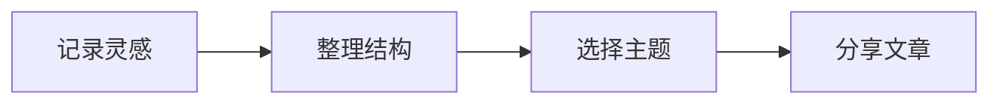

# 把想法写成文章

记录灵感，也认真对待每一次表达。

## 01  从一句话开始

用 Markdown 专注写作，让排版自然发生。标题、引用、图片与代码，都在右侧实时呈现。

> 好的工具，让注意力回到内容本身。


## 02  清晰地组织内容

- [x] 用标题建立清晰的结构
- [x] 通过列表梳理关键要点
- [ ] 在预览中即时确认效果
```python
def greet(name: str):
    return f"你好，{name}！"
```

### 每一种表达，都有合适的格式

| 内容 | 书写方式    | 效果     |
| :- | :------ | :----- |
| 重点 | **加粗**  | 清晰醒目   |
| 语气 | *斜体*    | 轻轻强调   |
| 修订 | ~~删除线~~ | 保留修改痕迹 |

试试切换右侧的 **10 种排版主题**。同样的文字，也可以有不同的气质。

### 公式与图表

行内公式：$E = mc^2$。

$$
\sum\_{i=1}^{n} i = \frac{n(n+1)}{2}
$$


---

支持粘贴截图、拖拽或上传图片。首次保存时给文章起个名字，之后按 **⌘S / Ctrl+S** 更新同一份文件。

这是一篇示例文章，你可以直接修改。[^note]

[^note]: 文章保存到本项目的 paper 文件夹，图片保存在 paper/assets 中。
